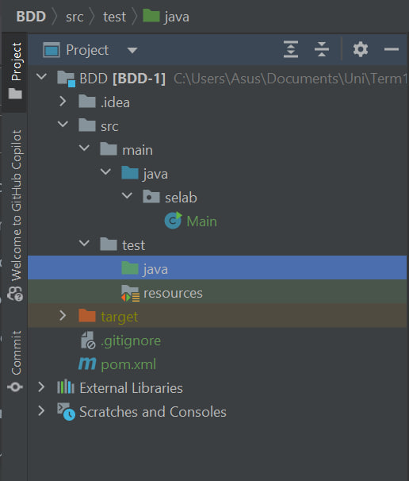

# BDD
4th Assignment: Transforming requirements into test cases using the Behavior-Driven Development (BDD) approach.

## بخش اول - اجرای یک مثال

### شماره‌ی ۱ الی ۵

ابتدا پروژه را ایجاد کرده و فایل `pom.xml` را با محتوای زیر درست می‌کنیم:

حال `maven project`
را با استفاده از کلیک راست روی `pom.xml`
و `add as maven project`
راه‌اندازی می‌کنیم تا دانلود‌های مورد نظر انجام شوند.

در این حالت روی نوار سمت راست صفحه کلیک کرده و تست maven را اجرا می‌کنیم:

مشاهده می‌شود که به خطا می‌خوریم:

برای رفع خطا بخش `properties`
را این‌گونه اضافه می‌کنیم:

مشاهده می‌شود که بیلد با موفقیت اجرا می‌شود

و به همین ترتیب junit, cucumber هم با موفقیت ایمپورت شده‌اند:

### شماره‌ی ۶ الی ۱۰

ابتدا همان طور که گفته شده است بخش `src/test/resources` را می‌سازیم.

حال در این بخش `calculator.feature`
را می‌سازیم:

همان طور که گفته شده است تعریف استپ‌ها را هم قرار می‌دهیم:

و کد جمع دو عدد را در calculator قرار می‌دهیم:

تست میون با موفقیت اجرا می‌شود:

اما اگر feature را به تنهایی اجرا کنیم به مشکل می‌خوریم:

برای رفع این مشکل در `pom.xml` این تغییر را می‌دهیم:

بر روی خود فایل `calculator.feature`
هم می‌رویم و با راست کلیک گزینه‌ی کانفیگ آن را هم به این صورت تغییر می‌دهیم:

اسم پکیج فایل فیچر را هم تغییر می‌دهیم تا در نهایت با موفقیت اجرا شود.

