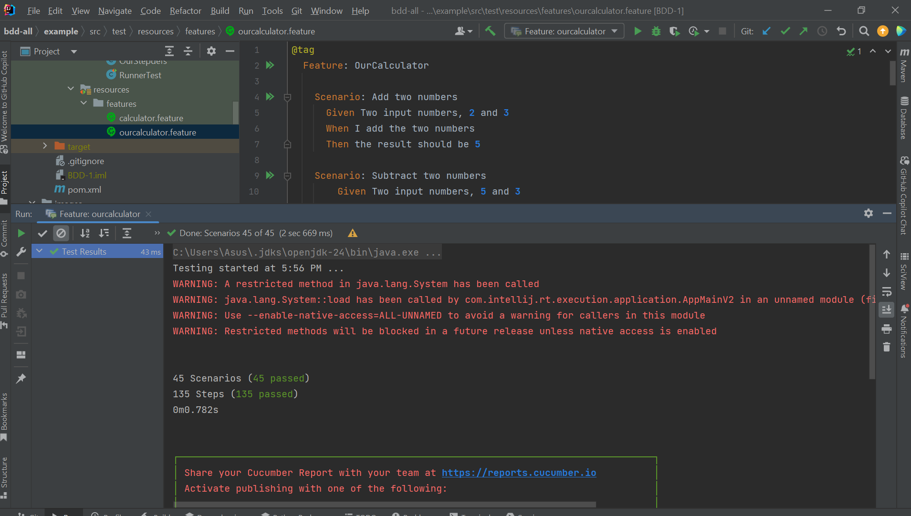

# BDD
4th Assignment: Transforming requirements into test cases using the Behavior-Driven Development (BDD) approach.

<div dir="rtl">

## بخش اول - اجرای یک مثال


ابتدا پروژه را ایجاد کرده و فایل `pom.xml` را با محتوای زیر درست می‌کنیم:


حال `maven project`
را با استفاده از کلیک راست روی `pom.xml`
و `add as maven project`
راه‌اندازی می‌کنیم تا دانلود‌های مورد نظر انجام شوند.


در این حالت روی نوار سمت راست صفحه کلیک کرده و تست maven را اجرا می‌کنیم:


مشاهده می‌شود که به خطا می‌خوریم:


برای رفع خطا بخش `properties`
را این‌گونه اضافه می‌کنیم:


مشاهده می‌شود که بیلد با موفقیت اجرا می‌شود


و به همین ترتیب junit, cucumber هم با موفقیت ایمپورت شده‌اند:


ابتدا همان طور که گفته شده است بخش `src/test/resources` را می‌سازیم.


حال در این بخش `calculator.feature`
را می‌سازیم:


همان طور که گفته شده است تعریف استپ‌ها را هم قرار می‌دهیم:


و کد جمع دو عدد را در calculator قرار می‌دهیم:


تست `maven` با موفقیت اجرا می‌شود:


اما اگر feature را به تنهایی اجرا کنیم به مشکل می‌خوریم:


برای رفع این مشکل در `pom.xml` این تغییر را می‌دهیم:


بر روی خود فایل `calculator.feature`
هم می‌رویم و با راست کلیک گزینه‌ی کانفیگ آن را هم به این صورت تغییر می‌دهیم:


اسم پکیج فایل `.feature` را هم تغییر می‌دهیم تا در نهایت با موفقیت اجرا شود.


حال به سراغ ایجاد `RunnerTest` می‌رویم.
ابتدا همان طور که گفته شده است، فقط انوتیشن `@RunWith(Cucumber.class)`
را استفاده می‌کنیم.


که همان طور که مشاهده می‌شود با ارور مواجه می‌شویم.
حال از انوتیشن `@CucumberOptions`
نیز استفاده می‌کنیم.


مشاهده می‌شود که با تغییر تست هم همه چیز به خوبی اجرا می‌شود.


حال  `Scenario Outline` را اضافه می‌کنیم. مشاهده می‌شود که نتیجه‌ی اجرای تست با مشکل روبه‌رو است.


با بررسی تست فیل شده متوجه میشویم تعریف ما اعداد منفی را در نظر نمیگیرد. حال کد موجود برای stepdefs را تغییر می‌دهیم و به صورت زیر انوتیشن‌ها را قرار می‌دهیم، تا هر عدد صحیحی دربرگرفته شود.


```java
    @Given("Two input values, {int} and {int}")
    public void two_input_values_and(Integer int1, Integer int2) {
        value1 = int1;
        value2 = int2;
    }
    @When("I add the two values")
    public void i_add_the_two_values() {
        calculator = new Calculator();
        result = calculator.add(value1, value2);
        System.out.println(result);
    }
    @Then("I expect the result {int}")
    public void i_expect_the_result(Integer int1) {
        int expected = int1;
        Assert.assertEquals(expected, result);
    }
```

حال مشاهده می‌شود که با تغییرات انجام شده، تست سناریو هم به درستی اجرا می‌شود.


## بخش آخر - ماشین حساب پیشرفته

در این بخش باید طبق دستور کار یک ماشین حساب پیاده سازی کنیم که قابلیت گرفتن اعداد و برخی عملگرها را داشته باشد. در فایل جدیدی به اسم `ourcalculator.feature`
شروع به اضافه کردن سناریوهای عادی و همچنین `Scenario Outline` می‌کنیم. به عنوان مثال، `Scenario Outline` به این صورت است:


برخی از سناریوهای عادی هم به این صورت هستند:


یک سری سناریوی خطای دیگر از جمله اورفلو، تقسیم بر صفر و... نیز در سناریوها آمده‌اند:


به علاوه، باید این عبارتها را مشابه قسمت قبل در فایل `ourstepdefs`
تعریف هم بکنیم.
به عنوان مثال:


برای پیاده‌سازی ماشین حساب و در نظر گرفتن ارورهای مختلف، می‌توان از کتابخانه‌ی `Math` و توابعی مانند `Math.addExact`
استفاده کرد.
مثلا:

```java
 public int add(int a, int b) {
        try {
            return Math.addExact(a, b);
        } catch (ArithmeticException e) {
            throw new ArithmeticException("Integer overflow");
        }
    }
```

حال به سراغ اجرا کردن تست‌ها می‌رویم.
اجرا کردن فایل `ourcalculator.feature`:



اجرا کردن فایل `RunnerTest`:


همان طور که مشخص است، همه‌ی تست‌ها به درستی اجرا می‌شوند.
    
توجه داشته باشید که در فایل `RunnerTest`
از آنجا که هم تعاریف بخش اول و دوم پروژه هر دو در یک پکیج قرار گرفته‌اند (`stepdefs`)
و هم فیچرها در یک پکیج قرار گرفته‌اند،
همان کانفیگ قبلی (و با `glue=stepdefs`)
کارساز است. 

</div>